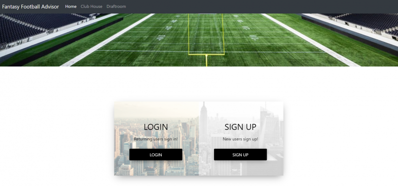
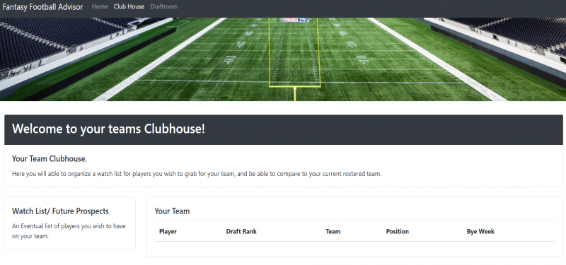
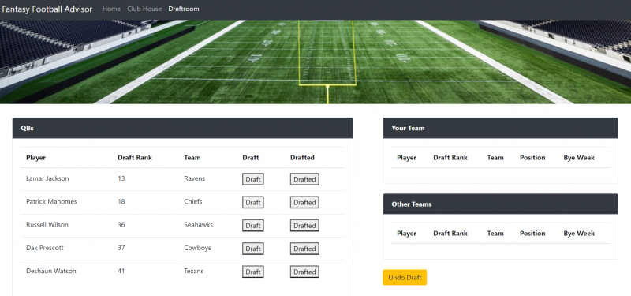

# Fantasy Football Advisor

## Overview

This is an App developed as part of a project for our coding bootcamp class.  At this point in the development it is intended to help new people to Fantasy Football with their draft.  

## How to use

* Users are required to set up an "account" or log in to an already created account. This will take them to the clubhouse page (which shows drafted teams) 

* The Clubhouse is the users homebase.

* From the clubhouse the user can click on "Draftroom" from navbar.  On the  page Draftroom page the user drafts their team.  
    * Each position will show the top 5 available players.  
    * The user can then click the 'draft' button to draft to their team or click the 'drafted' if the player is drafted to another team.  If either button is pushed the player is then removed from the available players lists.

## Technologies Used

* Bootstrap
* Sequilize
* ejs
* MySQL
* Javascript

 
### Links

* Git Hub Repo: https://github.com/cshanebrown78/Project_2
* App: https://immense-dawn-88778.herokuapp.com/